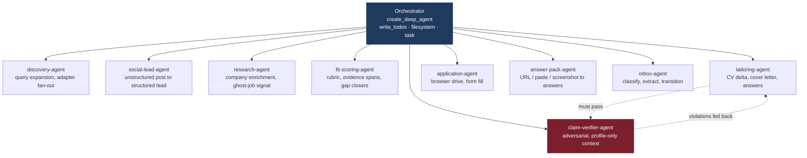
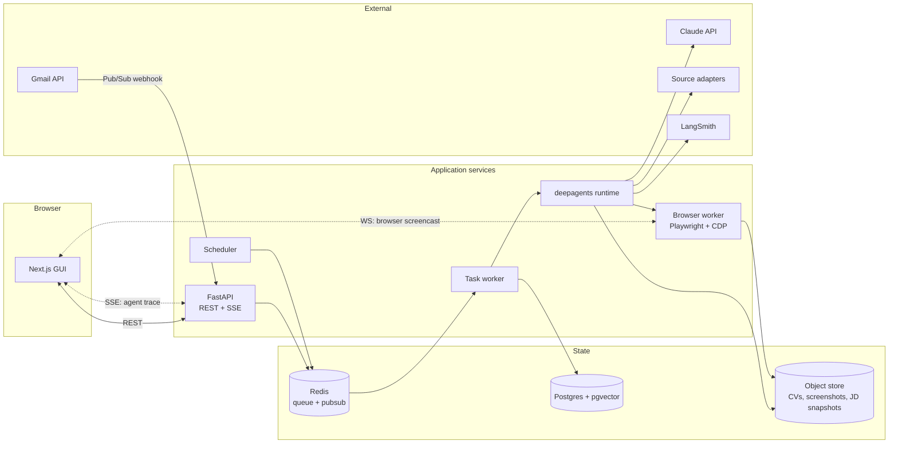

# Applicient — Product Requirements Document

**An agentic job-application system.** Finds openings across portals, ATS boards, company career sites and social posts; scores them honestly against your real qualifications; writes a tailored CV it can *prove* is truthful; fills the application; and keeps the whole pipeline updated from your inbox.

| | |
|---|---|
| **Version** | 0.1 (draft) |
| **Date** | 2026-08-19 |
| **Owner** | Adrian |
| **Status** | Pre-implementation |
| **Repo** | Open-source, self-hostable, deployment-ready |

---

## 1. Why this exists

Applying for jobs is a high-volume, low-signal grind with three distinct costs:

1. **Discovery cost.** Openings are scattered across LinkedIn, Jobstreet, Glints, Kalibrr, Indeed, company ATS boards, and hiring posts on LinkedIn, Instagram and Facebook. No single surface sees them all. Deduplicating across them is manual.
2. **Judgment cost.** Most listings are a bad fit and you can't tell until you've read 400 words of boilerplate. A "3–5 years required" line should be visible in one glance, weighted, and ranked — not discovered on paragraph four.
3. **Execution cost.** Every application re-asks the same twenty questions (notice period, expected salary, willingness to relocate, "why us"), and every one deserves a CV pointed at *that* role. Doing this well takes 30–60 minutes per application. Doing it fast means doing it badly.

Existing auto-appliers optimize (3) by spraying identical applications everywhere, which is why they get poor results and why platforms fight them. **Applicient's thesis is the opposite: automate the labor, not the judgment.** The agent does the reading, the matching, the drafting and the typing. The human keeps the decision to apply and the decision to submit.

### 1.1 Portfolio intent

This is also a demonstration artifact. It is deliberately built to show, in a real problem domain:

- A genuine multi-agent system (planning, delegation, context isolation, tool use) — not a prompt chain wearing an agent costume
- Human-in-the-loop control designed in, not bolted on
- An adversarial verifier agent enforcing a hard correctness property (no fabricated CV claims)
- Provider-agnostic model routing — stages bind to capability tiers, so the whole system runs on Claude, OpenAI, Gemini or a local model by changing one setting
- Cost engineering: a tiered model cascade, plus a per-call cost ledger and spend dashboard rather than guesswork
- Evaluation harnesses with CI regression gates, runnable per provider profile
- Browser automation with a real takeover path

---

## 2. Goals and non-goals

### 2.1 Goals

| # | Goal |
|---|---|
| G1 | Find relevant openings across heterogeneous sources from a plain list of target roles |
| G2 | Rank every opening against the user's actual profile with a legible, dimension-by-dimension rationale |
| G3 | Produce role-tailored CVs and application answers that contain **zero unsupported claims** |
| G4 | Reduce time-from-decision-to-submitted-application to under five minutes |
| G5 | Maintain an accurate pipeline of every job seen, shortlisted, applied to, and progressed |
| G6 | Detect interviews, assessments and deadlines from email and surface them before they're missed |
| G7 | Run unattended on a schedule and surface only what's new and worth attention |
| G8 | Clone-and-run in under 10 minutes; deploy to a server without rearchitecting |

### 2.2 Non-goals (v1)

- **Not a job board.** No public listings surface, no employer side.
- **Not a mass-application cannon.** Daily caps are a feature, not a limitation.
- **Not a CV writer from scratch.** It reweights and reframes evidence you already have; it never invents.
- **Not an anti-bot arms race.** Where a site actively refuses automation, the product degrades gracefully to Answer Pack rather than escalating.
- **Not multi-tenant SaaS in v1.** Schema is multi-tenant-ready; auth ships later.
- **Not an interview coach.** Interview prep is a v2 candidate (see §14).

---

## 3. Decisions of record

These were settled before drafting and constrain everything below.

| Area | Decision |
|---|---|
| **Stack** | FastAPI (Python) agent service + Next.js GUI + Postgres/pgvector + Redis + a separate Playwright browser worker |
| **Agent framework** | LangChain **deepagents** (`create_deep_agent`) on LangGraph |
| **Discovery** | Hybrid, adapter-based. Structured APIs first (ATS boards, aggregators, RSS); browser agent only where nothing else reaches |
| **Execution autonomy** | Agent fills, human reviews and submits. Live-browser handoff on captcha/login/MFA. Optional third-party captcha solver as a disabled-by-default plugin |
| **Answer Pack** | First-class output on every application, not a fallback |
| **Market** | Indonesia / SEA first, globally capable |
| **Email ingestion** | Gmail API — Pub/Sub push webhook **and** polling, both behind one adapter interface |
| **Proactivity** | Standing radar on a schedule, with notifications |
| **CV rendering** | Structured JSON → two deterministic renderers: HTML/CSS→PDF and LaTeX→PDF |
| **LLM providers** | **Provider-agnostic, switchable at runtime from the GUI.** Add a provider, paste an API key, test, bind it to a tier — no file editing, no restart. Agent stages bind to capability *tiers*, never to model names |
| **Cost accounting** | Every LLM call is metered and persisted to the database. Cost attributes to run, job, application and document, with budget enforcement and a spend dashboard |
| **Shipped defaults** | `openrouter-budget` preset for chat; `nvidia/nemotron-3-embed-1b:free` for embeddings. One OpenRouter key runs the entire product |

### 3.1 Assumptions taken without asking

Stated so they can be overridden cheaply:

- **Deployment model:** single-user, local-first, no auth in v1. Every table carries `user_id` from day one so multi-tenancy is an auth layer, not a migration.
- **Default model preset: `openrouter-budget`.** Cheap open models across all three tiers, so a single OpenRouter key gets a new user running at the lowest possible cost. The Claude preset ships alongside as the quality reference the eval suites are calibrated against; switching is one click.
- **Default embedding model: `nvidia/nemotron-3-embed-1b:free`** over OpenRouter — multilingual, 32k input, free tier, same key as chat (§7.5).
- **Personas:** supported in v1 — one master profile, multiple role tracks (e.g. *AI Engineer*, *Data Analyst*) each with their own base CV and preferences. Expected count is two or three, so persona management lives inside Profile Studio rather than earning its own surface.
- **Notifications:** in-app, email and **Telegram** in v1 — Telegram is the realistic channel for the target market. Discord behind the same interface.
- **Social outreach drafting** (DM the poster of a hiring post): v1.5.
- **Language:** bilingual ID/EN throughout — job descriptions, CV output, and application answers.

---

## 4. Users and journeys

### 4.1 Primary persona

**Adrian, early-career AI engineer, Jakarta.** 1–2 years of experience, applying to 10–30 roles a month across Indonesian and remote-global postings. Technical enough to run Docker and hold API keys. Cares about not misrepresenting himself. Bottlenecked on tailoring and tracking, not on writing.

### 4.2 Journeys

**J1 — Onboarding (once, ~15 min).** Upload CV → agent parses it into a structured profile and an *evidence bank* of atomic, individually-citable accomplishments → user corrects and confirms → adds preferences (target roles, salary floor, locations, remote policy, visa status, notice period, deal-breakers) → creates one or more personas.

**J2 — Standing radar (daily, automatic).** Scheduler fires the discovery agent across configured sources → new postings are normalized, deduplicated against everything seen before and against the already-applied ledger → cheap prefilter kills the obvious mismatches → survivors get a full scored rubric → user gets one notification: *"9 new, 2 strong."*

**J3 — Triage (5 min).** User opens the Job Inbox, sorted by fit. Each card shows score, the two or three reasons it scored that way, red flags, and the gap. User bulk-selects the ones worth pursuing.

**J4 — Prepare (2 min per job, agent-driven).** For each selected job the agent produces a tailored CV (as a diff against the master, so the user can see exactly what changed and why), a cover letter if the posting wants one, and an Answer Pack covering the application's screening questions. The claim verifier signs off before anything is shown.

**J5 — Submit.** Either the browser agent navigates and fills the form and stops at the submit button for review; or the user copy-pastes from the Answer Pack. On captcha, login or MFA the agent hands the live browser to the user, waits, and resumes.

**J6 — Track (passive).** Confirmation, rejection, interview-invite and assessment emails land in a filtered Gmail label, get read by the inbox agent, and move the application's state. Interviews and deadlines produce notifications and calendar entries.

**J7 — Hygiene (occasional).** User imports application history from LinkedIn/Jobstreet CSV exports so already-applied roles stop reappearing in discovery.

---

## 5. Functional requirements

### F1 — Profile and knowledge base

| ID | Requirement |
|---|---|
| F1.1 | Ingest CV in PDF/DOCX and parse into a structured `Profile` (schema-validated JSON) |
| F1.2 | Decompose experience into an **evidence bank**: atomic, individually-addressable accomplishment records, each with `id`, text, skills, metrics, employer, date range, and verification status |
| F1.3 | User can edit, add and confirm every parsed field; nothing is used until confirmed |
| F1.4 | Capture preferences: target roles, seniority, salary floor/target (multi-currency, IDR-aware), locations, remote policy, industries to include/exclude, company-size preference, visa/work-authorization status, notice period, deal-breakers |
| F1.5 | Support multiple **personas** over one profile — each selecting a subset of the evidence bank, a base CV template, and its own preferences |
| F1.6 | **Form answer memory:** persist every question the user has ever answered on an application, keyed by semantic similarity, so recurring questions are pre-answered and never re-asked |
| F1.7 | Store supporting documents (portfolio links, transcripts, certificates, references, ID docs) for attachment during application |
| F1.8 | Semantic retrieval over the evidence bank (pgvector) so tailoring can pull the most relevant evidence for a given JD |
| F1.9 | **Preferences are captured as a guided questionnaire, not free text** — each `Preference` field (F1.4) is presented as its own plain-language question with structured input (choice, multi-select, range, tag list), aliased so the underlying schema stays typed. Includes an explicit **willing-to-relocate** flag (global or per-target-location), which F4.3 and F2.10 both read |

### F2 — Job discovery

| ID | Requirement |
|---|---|
| F2.1 | Pluggable **source adapter** interface: `search(query, filters) -> RawPosting[]`, `fetch_detail(url) -> RawPosting`, plus declared capabilities, rate limits and auth requirements |
| F2.2 | **Tier 1 — structured APIs (no scraping):** Greenhouse, Lever, Ashby, Workable, SmartRecruiters, Recruitee board APIs; Adzuna; JSearch; SerpAPI Google Jobs; arbitrary RSS/Atom |
| F2.3 | **Tier 2 — portals via browser agent:** LinkedIn Jobs, Jobstreet ID, Glints, Kalibrr, Indeed ID, Dealls, KitaLulus, TopKarir |
| F2.4 | **Tier 3 — social signal:** LinkedIn posts, X, Instagram and Facebook groups. A dedicated extractor converts unstructured posts into structured leads with an `apply_via` field (`dm` / `email` / `form` / `link`). Messaging-app *loker* channels (Telegram, WhatsApp) are explicitly **out of scope** as a source |
| F2.5 | **Company career-site resolution:** given a company name (typed directly, or produced by F2.10), probe known ATS URL patterns (`boards.greenhouse.io/{slug}`, `jobs.lever.co/{slug}`, `{slug}.ashbyhq.com`, `apply.workable.com/{slug}`, …). If no ATS is detected, fall back to the browser agent crawling `/careers` |
| F2.6 | User supplies a plain list of target role titles; the agent expands each into source-appropriate query variants (synonyms, seniority variants, ID/EN equivalents) |
| F2.7 | Saved searches, each with its own sources, filters, schedule and persona binding |
| F2.8 | Every run records `SourceRun` telemetry: postings seen, new, deduped, errors, duration, cost |
| F2.9 | Honor `robots.txt` by default for Tier 2/3 crawling; overridable per source with an explicit acknowledgment |
| F2.10 | **Preference-driven company discovery.** Given a persona's `Preference` (target roles, industries, company-size band, locations/relocation), a discovery step proposes a ranked candidate company list with its rationale, then feeds each candidate through F2.5 resolution across every Tier-1 ATS pattern. Resolved candidates join a persona-scoped scan list per ATS type the user reviews and approves before they're ever queried — the agent proposes, it does not silently start scraping. This is the primary path for Tier-1 ATS sources; manually typing a company identifier (as today) remains available as a direct-add fallback. A company resolving to no known ATS is recorded as needing generic career-site scraping rather than dropped — the same classification also runs against the `apply_url` of any posting already surfaced by an aggregator or social source, since that link is often the first sign a company runs its own board or bespoke site |

### F3 — Normalization, deduplication and enrichment

| ID | Requirement |
|---|---|
| F3.1 | Normalize every raw posting into a canonical `Job` (title, company, location, remote policy, seniority, employment type, salary range + currency, posted date, requirements, responsibilities, benefits, apply URL, source) |
| F3.1a | **Salary is never estimated.** Many SEA postings omit it; when absent the field stays null and the UI shows "not stated". No inferred bands, no market-data guesses — a fabricated number would corrupt both the salary-overlap score and the user's negotiating position |
| F3.2 | **Deduplication** via three signals, in priority order: (a) exact ATS requisition ID where available — authoritative; (b) canonical key of `normalize(company) + normalize(title) + normalize(location)`; (c) embedding cosine similarity over JD body above threshold |
| F3.3 | Model the many-to-one relationship explicitly: N `JobSighting` rows (one per source that saw it) point at one `Job`. Preserve every sighting — they carry the ghost-job signal |
| F3.4 | **Preferred apply channel:** when a job is visible on both an aggregator and the company's own ATS, route the application through the ATS |
| F3.5 | **Ghost-job / stale-posting detection** from: age since first sighting, repost count across sightings, `posted_at` resets, JD boilerplate score, and company hiring velocity. Surfaced as a red flag with its reasoning, never as a silent filter |
| F3.6 | **Company enrichment:** size, industry, funding stage, tech stack, Glassdoor-equivalent sentiment, recent news. Cached per company with a TTL |
| F3.7 | Exclude anything present in the already-applied ledger (F9) before scoring, saving the cost |

### F4 — Fit scoring

| ID | Requirement |
|---|---|
| F4.1 | Two-stage cascade: a cheap **prefilter** pass produces a coarse keep/drop with a one-line reason; survivors get the full rubric. Cost rationale in §11.2 |
| F4.2 | Full rubric emits **structured, schema-validated** output — never a bare number |
| F4.3 | Dimensions scored independently: hard requirements met/missed, years-of-experience delta, skill match (matched / partial / missing), seniority fit, domain fit, location & work-authorization fit, salary overlap, company-stage fit, language requirements. Where salary is not stated (F3.1a) that dimension is marked *unknown* and excluded from the weighted total rather than scored as zero |
| F4.3a | **Location fit reads the persona's `Preference`, not just the profile's home address.** A job far from the user's stated location is only penalized if it's *also* outside `Preference.locations` and the user hasn't set willing-to-relocate (F1.9) for that job's location; onsite roles in a location the user wants to relocate to score on merit, not distance |
| F4.4 | **Experience gap is a penalty multiplier, not a disqualifier.** A role asking 3–5 years against a 1-year profile is ranked low but stays visible and stays applicable — stretch applications are a legitimate user choice |
| F4.5 | Hard blockers (work authorization, mandatory certification, on-site in an excluded city) drop the recommendation to `skip` regardless of other dimensions, and say which blocker fired |
| F4.6 | Every score carries **evidence spans**: the exact JD text that drove each dimension, so the user can audit the judgment |
| F4.7 | Emit **gap closers** — what the user should emphasize, learn, or address to make the application land |
| F4.8 | Emit **red flags**: ghost-job signals, unpaid or below-market pay, absurd requirement lists for junior roles, MLM/scam patterns, vague or contentless JDs |
| F4.9 | Recommendation enum: `strong_apply` / `apply` / `stretch` / `skip` |
| F4.10 | Scores are recomputed when the profile or persona changes, not frozen at discovery time |

### F5 — Document tailoring and the truthfulness guarantee

| ID | Requirement |
|---|---|
| F5.1 | Generate a tailored CV as a **structured JSON delta** against the master profile — reordering, reweighting, rephrasing, and selecting from the evidence bank. The model never emits layout |
| F5.2 | Two deterministic renderers off the same JSON: HTML/CSS→PDF and LaTeX→PDF. Both must produce a real, ATS-parseable text layer |
| F5.3 | Every generated bullet carries the `evidence_id`(s) it derives from. A bullet with no evidence link cannot be rendered |
| F5.4 | **Claim verifier (hard gate).** An adversarial verifier subagent receives *only* the master profile and the generated CV — deliberately **not** the job description, so it cannot be persuaded by what the role wants. It classifies every claim as `SUPPORTED` / `REFRAMED_OK` / `UNSUPPORTED` / `INFLATED` |
| F5.5 | Any `UNSUPPORTED` or `INFLATED` claim triggers regeneration with the specific violations fed back. After two failed attempts the document is surfaced to the user with the offending claims highlighted and **cannot be exported until resolved** |
| F5.6 | The UI presents tailoring as a **side-by-side diff** against the master CV, with per-change rationale and the verifier's report inline |
| F5.7 | Cover letters and long-form "why this company / why this role" answers are **generated on request, not by default** — a per-application toggle with a global default in settings. When generated they run through the same evidence-linked, verified pipeline. Postings that explicitly require one are flagged in the Composer |
| F5.8 | Version every generated document, bound to the job group and the profile revision that produced it |
| F5.9 | Never generate claims about protected characteristics, and never alter dates, employers, titles, or degree classifications |
| F5.10 | Tailoring targets a **job group** — a user-named collection of one or more scored job listings — rather than a single listing, so one CV can serve every listing in the group and version count stays low. Grouping is manual (user assigns listings from the Inbox) for now; auto-suggested clustering by similarity is an explicit, deferred follow-up, not built in this milestone |
| F5.11 | LaTeX→PDF is the primary renderer and gets a **live preview** in the Composer: the rendered PDF updates as the delta is edited/regenerated, debounced to the renderer's real compile time rather than promised as literal keystroke-level typesetting. HTML/CSS→PDF (F5.2) follows once the LaTeX pipeline is proven end to end |
| F5.12 | Multiple selectable **CV templates** in a gallery, including at least one user-supplied custom template. Adding a template is a config/asset addition, not a code change, mirroring this codebase's source-adapter extensibility pattern |
| F5.13 | Per job group, surface a **skill-gap checklist**: skills the group's listings ask for that the evidence bank doesn't yet support, each with a checkbox. Checking one off records a new self-attested evidence item (never a raw CV edit) so the next tailoring pass can honestly cite it — the truthfulness gate (F5.4) is never bypassed for a checked-off skill |

### F6 — Application execution

| ID | Requirement |
|---|---|
| F6.1 | **Autonomy levels**, per source, user-selected: **L0** manual · **L1** Answer Pack only · **L2** fill and review (default) · **L3** fill and submit under a hard daily cap (explicit opt-in) |
| F6.2 | Browser agent introspects a form via the **accessibility tree**, not raw DOM scraping, and produces a structured field map before filling anything |
| F6.3 | Field-to-answer resolution order: form answer memory → profile fields → generated answers → **ask the user**. Never guess on a field it cannot ground |
| F6.4 | Handle file uploads (CV, cover letter, portfolio, certificates) and multi-page / multi-step application flows with resumable state |
| F6.5 | **Live browser handoff.** On captcha, login wall, MFA, or any unrecognized blocking state, the agent interrupts, streams the live browser into the GUI, and lets the user act directly. It resumes from where it stopped |
| F6.6 | Persistent authenticated browser contexts per source. **Passwords are never stored** — the user logs in once inside the live view and the session persists in an encrypted profile directory |
| F6.7 | At L2, always stop before the submit control and present a full review: every filled field, every attachment, a screenshot |
| F6.8 | **Answer Pack** generated for every application regardless of path: each question with its answer, ready to copy, plus the tailored CV and attachments. Inputs may be a live URL, a pasted job posting, or a **screenshot of the form** (vision-based extraction) |
| F6.9 | Full audit trail per attempt: screenshots at each step, field map, values written, errors, and the final state |
| F6.10 | **Captcha solver plugin interface** — an optional adapter for user-supplied third-party services. Ships disabled, with no bundled provider, and requires an explicit acknowledgment of the account and terms-of-service risk before it can be enabled |
| F6.11 | Bulk apply: user selects N jobs; the agent processes them sequentially under rate limits, pausing on every handoff and queueing the rest |

### F7 — Pipeline and tracking

| ID | Requirement |
|---|---|
| F7.1 | Every job the system has ever seen persists with full lineage: which source, when, what score, what happened next |
| F7.2 | Application states: `discovered` → `shortlisted` → `preparing` → `ready` → `applied` → `acknowledged` → `screening` → `assessment` → `interview` → `offer` / `rejected` / `withdrawn` / `ghosted` |
| F7.3 | `ghosted` is derived, not manual: no state change for N days after applying (configurable, default 30) |
| F7.4 | Kanban board plus filterable table; per-application timeline of every event with its source (agent, email, user) |
| F7.5 | Analytics: applications per week, response rate, response rate by source, by fit score band, by persona, funnel conversion, median time-to-response |
| F7.6 | Export to CSV/JSON |

### F8 — Email intelligence and notifications

| ID | Requirement |
|---|---|
| F8.1 | Gmail OAuth with **read-only** scope. Two ingestion adapters behind one interface: Pub/Sub push webhook, and interval polling |
| F8.2 | **Scoped access by construction.** The user creates a Gmail filter that labels matching mail (e.g. `Applicient`); the agent only ever reads that label. The full inbox is never queried. This constraint is enforced in code, not by prompt |
| F8.3 | Classify each message: application confirmation, rejection, interview invitation, assessment/psychotest invitation, offer, recruiter outreach, scheduling request, information request, irrelevant |
| F8.4 | Match each message to an existing `Application` by company, role, thread, and reference IDs. Unmatched messages go to a review queue rather than being dropped or guessed |
| F8.5 | Extract event details: date, time, timezone, duration, meeting link, interviewer names, format, and any deadline |
| F8.6 | Propose the resulting state transition. **Confidence-gated:** high confidence applies automatically; low confidence queues for user confirmation |
| F8.7 | Notify on: interview invitations, assessments and psychotests, deadlines approaching, offers, and each daily radar summary |
| F8.8 | Generate `.ics` calendar entries for scheduled events |
| F8.9 | Never send email on the user's behalf without explicit per-message approval |

### F9 — Already-applied ledger

| ID | Requirement |
|---|---|
| F9.1 | Import from CSV/JSON exports of LinkedIn ("My Items → Applied Jobs") and Jobstreet application history |
| F9.2 | Derive history from Gmail: application-confirmation emails matched back to companies and roles |
| F9.3 | Manual mark-as-applied from any job card |
| F9.4 | Discovery filters against the ledger by canonical key plus fuzzy company+title match, before scoring |
| F9.5 | Surface near-misses ("you applied to a similar role at this company 3 months ago") rather than silently hiding them |

### F10 — Scheduling and the standing radar

| ID | Requirement |
|---|---|
| F10.1 | Cron-style schedules per saved search |
| F10.2 | Each run surfaces only what is **new since the last run** for that search |
| F10.3 | All jobs are idempotent and resumable; a crashed run resumes rather than restarting |
| F10.4 | Per-run cost tracking with a configurable budget cap that halts the run |
| F10.5 | Digest notification per run, thresholded so quiet days stay quiet |

### F11 — Settings, safety and secrets

| ID | Requirement |
|---|---|
| F11.1 | Secrets (LLM keys, source API keys, OAuth tokens) in OS keychain locally, or an env-injected secret store when deployed. Never in the database in plaintext |
| F11.2 | Per-source rate limits: token bucket, randomized delay, concurrency cap, optional business-hours-only window |
| F11.3 | Global daily application cap (default 15) and per-source caps |
| F11.4 | Circuit breaker: repeated 403/429 from a source disables it and notifies |
| F11.5 | **PII redaction option** — strip address, phone, and date of birth from anything sent to the LLM |
| F11.6 | Full data export and hard delete |

### F12 — Providers and model configuration

| ID | Requirement |
|---|---|
| F12.1 | No agent, subagent, tool or prompt may reference a model by name. Stages bind to capability tiers only (§7.5) |
| F12.2 | **Provider connections are managed entirely in the GUI:** choose provider, paste API key, test, save. No file editing, no restart, no redeploy |
| F12.3 | Ship adapters for OpenRouter, Anthropic, OpenAI, Google AI Studio, Mistral, Ollama/vLLM, and a generic `openai_compatible` adapter taking a `base_url` |
| F12.4 | Multiple provider connections active simultaneously; different tiers may resolve to different providers |
| F12.5 | **Test connection** performs a real minimal call and surfaces the actual failure (invalid key vs unreachable vs unauthorized). Untested or failing connections cannot be bound to a tier |
| F12.6 | API keys encrypted at rest, never returned to the client after saving — masked hint only. Deleting a connection revokes it from all bindings and warns which stages are affected |
| F12.7 | **Model catalog discovered live** from each connected provider, cached with a TTL, refreshable on demand |
| F12.8 | Ingest pricing from the provider where exposed (OpenRouter returns per-token pricing in its catalog); otherwise use a bundled, user-editable table; otherwise record `cost_known: false` |
| F12.9 | Per-tier model selection plus per-stage override, both from the GUI. Model picker shows context window, capability badges and price per million tokens |
| F12.10 | Named profiles as saved presets, switchable in one click, exportable to YAML for headless deployment |
| F12.11 | **Capability preflight**: incompatible assignments are visibly blocked in the picker with the reason, and a run validates its full binding before starting rather than failing mid-flight |
| F12.12 | Ordered fallback chain per tier for rate limits, timeouts, refusals and capability errors. Every substitution recorded on the call row |
| F12.13 | Binding changes take effect on the next run. In-flight runs finish on the binding they started with, recorded on `AgentRun` |
| F12.14 | Provider-specific optimizations applied where supported, ignored where not. **No output contract may depend on a provider feature** |
| F12.15 | **Embedding model changes are a migration, not a swap** (§7.5): embeddings keyed by `(model_id, dimension)`, changing the model enqueues a re-embed job with progress, the old index serves until cutover, and dedup thresholds are recalibrated against the eval set |
| F12.16 | Eval suites (§13.2) runnable against any profile, so a user can measure what a provider switch costs them in quality |

### F13 — Cost tracking and budget governance

| ID | Requirement |
|---|---|
| F13.1 | **Every LLM call writes an `LlmCall` row.** Instrumentation lives in a LangChain callback handler at the framework boundary — no call site can forget to log, and adding a subagent gets metering for free |
| F13.2 | Record per call: provider, model, tier, stage, subagent, agent run, agent step, input/output/cached/reasoning tokens, latency, status, error, provider request id, fallback substitution |
| F13.3 | Cost computed at call time from the pricing registry and **stamped with `pricing_version`**. Historical rows never shift when a provider changes prices |
| F13.4 | Cache-read and cache-write tokens priced separately from fresh input, since prompt caching is central to the cost strategy and collapsing them hides its effect |
| F13.5 | Zero-cost models (local, self-hosted) still log tokens, latency and call counts. The dashboard works identically for a fully local setup |
| F13.6 | Unpriced models record `cost_known: false` rather than reporting as free |
| F13.7 | **Cost attribution** rolls up to: agent run, job, application, generated document, saved search, source, persona, and calendar period |
| F13.8 | Budget caps at run, daily and monthly scope. Soft threshold warns; hard threshold halts the run and interrupts with spend so far |
| F13.9 | Pre-flight estimate before an expensive operation (bulk apply, large radar run), shown to the user before it starts |
| F13.10 | Non-LLM costs recorded in the same ledger where they exist: search API calls, captcha solver credits, embedding calls, proxy usage |
| F13.11 | Cost dashboard (§6) with time series, breakdowns by model / stage / subagent / source / persona, and unit economics |
| F13.12 | Ledger export to CSV/JSON; optional reconciliation against a provider's usage API where one is exposed |

---

## 6. Product surfaces

| Surface | Purpose |
|---|---|
| **Profile Studio** | CV upload and parse, evidence bank editor, preferences, personas, documents |
| **Radar** | Saved searches, source configuration and health, schedules, run history |
| **Job Inbox** | Ranked feed. Each card: score, top reasons, red flags, gap. Score-breakdown drawer with evidence spans. Bulk select |
| **Application Composer** | Side-by-side CV diff, verifier report, cover letter, Answer Pack, attachments, submit path selector |
| **Pipeline** | Kanban + table, per-application timeline, analytics |
| **Run Console** | Live agent trace — todo list, subagent dispatches, tool calls, file writes, token spend. The observability surface, and the clearest demonstration of the agent actually reasoning |
| **Live Browser** | Embedded browser view with a takeover control, used for handoffs and for watching a fill in progress |
| **Events** | Email-derived timeline, upcoming interviews and assessments, review queue for low-confidence classifications |
| **Models & Providers** | Add and test provider connections; live model catalog with context window, capability badges and price per million tokens; bind tiers and per-stage overrides; saved presets; embedding model with re-index progress |
| **Cost & Usage** | Spend over time; breakdown by provider, model, tier, stage, subagent, source and persona; unit economics (cost per job scored, per application submitted, per interview obtained); cache-hit rate; budget status; anomaly flags |
| **Settings** | Sources, Gmail connection, autonomy levels, rate limits, budget caps, privacy, data export |

---

## 7. Agent architecture

### 7.1 Why deepagents

The framework earns its place here on four specific properties, each mapping to a real requirement:

- **Planning (`write_todos`)** — a radar run is genuinely multi-step and variable-length: expand queries, hit N sources, normalize, dedupe, prefilter, score, notify. The agent needs to hold and revise a plan.
- **Virtual filesystem** — job descriptions, raw HTML and DOM snapshots are large and mostly irrelevant. The filesystem middleware lets the agent write them out and let subagents read only what they need, which is the difference between scoring 100 jobs and running out of context at 20.
- **Subagent context isolation** — each subagent gets fresh context and hands back a single result. Scoring fifty jobs does not accumulate fifty job descriptions in the orchestrator.
- **`interrupt_on`** — human-in-the-loop is a first-class framework primitive here, which is exactly what F6.5 and F6.7 require. Approval gates are configuration, not custom control flow.

### 7.2 Topology

### 7.3 Subagent specifications

| Subagent | Context it receives | Returns | Tier | Required capabilities |
|---|---|---|---|---|
| `discovery-agent` | Saved search, persona, source configs | Raw postings written to the virtual filesystem; a manifest | `balanced` | tools |
| `social-lead-agent` | Post text or screenshot | Structured lead with `apply_via`, contact, confidence | `fast` | structured output, vision |
| `research-agent` | Company name, domain | Enrichment record, hiring-velocity and ghost signals | `balanced` | tools |
| `fit-scoring-agent` | One JD + persona + evidence bank summary | Full rubric, structured | `fast` (prefilter) → `balanced` (full) | structured output |
| `tailoring-agent` | JD + full evidence bank + fit rubric | CV delta JSON with `evidence_id` links | `deep` | structured output, long context |
| `claim-verifier-agent` | **Master profile + generated document only** | Per-claim verdicts | `deep` | structured output |
| `application-agent` | Job, documents, form answer memory, browser tools | Fill trace, final state | `deep` | tools, vision |
| `answer-pack-agent` | Form schema or screenshot + profile + generated docs | Question→answer pack | `balanced` | vision |
| `inbox-agent` | One labeled email + candidate applications | Classification, extraction, proposed transition + confidence | `balanced` | structured output |

The verifier's context restriction is the whole point of it. Give it the job description and it starts reasoning about what the role needs; withhold the job description and it can only reason about what the profile supports. That asymmetry is what makes the gate meaningful.

### 7.4 Tool inventory

**Discovery** — `search_source(source_id, query, filters)`, `fetch_job_detail(url)`, `resolve_company_ats(company)`, `expand_role_queries(role, locale)`

**Knowledge** — `profile_get(fields)`, `evidence_search(query, k)`, `form_answer_lookup(question)`, `form_answer_save(question, answer)`

**Persistence** — `job_upsert`, `sighting_record`, `score_write`, `application_create`, `application_transition`, `ledger_check`

**Documents** — `cv_render(json, template, format)`, `document_version_save`, `claim_extract(document)`

**Browser** — `browser_open(url, context_id)`, `browser_snapshot()` (accessibility tree), `browser_fill(field_map)`, `browser_click(ref)`, `browser_upload(ref, file)`, `browser_screenshot()`, `browser_request_handoff(reason)`, `browser_wait_for_human()`

**Research** — `web_search`, `web_fetch`

**Comms** — `notify(channel, payload)`, `calendar_event_create(ics)`

**Filesystem** (middleware-provided) — `ls`, `read_file`, `write_file`, `edit_file`

### 7.5 Model routing — runtime provider switching

**Switching provider is a GUI action, not a code or config change.** Open Settings → Models, pick a provider, paste an API key, hit Test, save. Pick which model serves each tier. The next run uses it. No file editing, no restart, no redeploy.

The tier indirection below is what makes that safe: because no agent, subagent, tool or prompt ever names a model, swapping the binding underneath them cannot break a call site.

#### Provider connections

A **provider connection** is user data in the database, not configuration on disk:

| Field | Notes |
|---|---|
| `provider` | `openrouter` / `anthropic` / `openai` / `google` / `mistral` / `ollama` / `openai_compatible` |
| `api_key` | Encrypted at rest; OS keychain locally, injected secret store when deployed. Never rendered back to the GUI after saving — only a masked hint |
| `base_url` | Optional. Set it and any OpenAI-compatible gateway works with no adapter: LiteLLM, vLLM, Together, a corporate proxy |
| `status` | `untested` / `ok` / `auth_failed` / `unreachable`, with a last-verified timestamp |

**Test before save.** The GUI verifies the key with a minimal live call and reports the real error — an invalid key says so, a reachable-but-unauthorized endpoint says so. A connection that fails its test can still be saved, but is marked and excluded from tier binding until it passes.

Multiple connections coexist. Nothing prevents running discovery on OpenRouter, verification on Anthropic and embeddings on a local Ollama instance simultaneously.

#### Capability tiers

Stages bind to tiers, never to model names:

| Tier | Used for | Selection criterion |
|---|---|---|
| `fast` | Extraction, normalization, prefiltering, social-lead parsing | Cheapest model that reliably honors a schema. High volume, low judgment |
| `balanced` | Full fit rubric, research, answer pack, email classification | Real reasoning over bounded input |
| `deep` | CV tailoring, claim verification, browser navigation | Where a mistake is expensive or the reasoning is genuinely hard |
| `embedding` | Dedup similarity, evidence retrieval, form answer memory | Separate lifecycle — see below |

#### Model catalog — discovered, not hardcoded

Each provider adapter implements `list_models()`, and the catalog refreshes from the live provider rather than from a table someone has to maintain:

| Provider | Discovery | Pricing |
|---|---|---|
| OpenRouter | `GET /api/v1/models` | **Returned by the API**, per-token, always current |
| OpenAI | `GET /v1/models` | Bundled table, user-editable |
| Anthropic | `GET /v1/models` (context window and capabilities included) | Bundled table, user-editable |
| Google AI Studio | `models.list` | Bundled table, user-editable |
| Ollama / vLLM | `GET /api/tags` or `/v1/models` | Zero — self-hosted |
| OpenAI-compatible | `GET /v1/models` | Unknown unless the user supplies it |

OpenRouter deserves the call-out: because its catalog endpoint carries live per-token pricing, adding an OpenRouter key gives accurate cost accounting across hundreds of models with no pricing table to maintain and nothing to go stale. Where pricing is unavailable, calls still meter tokens and record `cost_known: false` (F13.6) — never silently zero.

Catalog entries cache with a TTL and refresh on demand from the GUI.

#### Binding tiers to models

Settings → Models presents, per tier, a searchable dropdown of every model across every connected provider, annotated with context window, capability badges and price per million tokens. Two levels:

1. **Tier binding** — the normal case. Three choices covers the whole system.
2. **Per-stage override** — pin one subagent to a specific model. The common shape is everything cheap or local, with `claim-verifier-agent` on a frontier model, since that is the one stage where being wrong actually costs something.

**Saved profiles** are named presets over those bindings (`claude`, `openrouter-budget`, `local`, …), seeded with sensible defaults and switchable in one click. They serialize to YAML for headless deployment and for committing a known-good setup to the repo — but the GUI is the primary surface, and the file is an export of state rather than the source of it.

#### Capability preflight

Capability requirements are per stage (§7.3). The GUI shows compatibility inline — a model lacking vision is visibly disabled for `application-agent` with the reason stated — and a run validates its full binding before starting. A mismatch fails immediately, naming the stage, the missing capability and the model, rather than surfacing three minutes into a browser session.

#### Fallbacks

Each tier carries an ordered fallback chain. On rate limit, timeout, refusal or capability error the runtime walks down it and records the substitution on the `LlmCall` row, so a run that quietly degraded is visible afterward instead of mysterious. With OpenRouter the chain can also be delegated upstream to its own routing.

#### Embeddings have a different lifecycle

**Default: `nvidia/nemotron-3-embed-1b:free` via OpenRouter.** 2,048 dimensions, 32,768-token input window, multilingual text and code, free tier. Three properties make it the right seed for this product specifically:

- **Multilingual** — the corpus is bilingual ID/EN by design (§3.1). An English-only embedding model would quietly degrade dedup and evidence retrieval on Indonesian postings, and degrade *silently*, which is the worst failure mode for a similarity index.
- **32k input window** — a full job description embeds without chunking, so dedup compares whole postings rather than fragments.
- **Free on OpenRouter** — the same key that serves chat serves embeddings, and the zero-cost default keeps the clone-and-run story intact.

**Schema consequence — use `halfvec`, not `vector`.** pgvector's HNSW index caps the `vector` type at 2,000 dimensions, because an index tuple must fit in an 8 KB page. At 2,048 dimensions this model is just over that line. The column type is therefore `halfvec(2048)`, which pgvector indexes up to 4,000 dimensions and which also halves storage. Writing `vector(2048)` compiles fine and only fails at index creation — worth pinning in the M0 schema rather than discovering later.

**Free-tier rate limits are a real constraint.** OpenRouter rate-limits free endpoints. Bulk operations — the initial corpus embed, a re-embed migration, a large radar run — must batch, respect `Retry-After`, and checkpoint so a throttled job resumes rather than restarts. The GUI offers a paid embedding model as an override for bulk backfill; steady-state daily volume is expected to sit comfortably inside the free tier.

Chat models hot-swap freely; **embedding models do not.** Dimension is part of the index, and vectors written by one model are meaningless to another even at matching dimension. So a change of embedding model is a migration:

- Embeddings live in a table keyed by `(model_id, dimension)`, not a single fixed-width column, so more than one index can exist at once.
- Changing the model enqueues a **re-embed job** over the evidence bank, job corpus and form answer memory, with progress shown. The old index stays live and serving until the new one completes, then cuts over.
- Dedup similarity thresholds are calibrated per embedding model. Switching re-runs that calibration against the dedup eval set (§13.2) rather than carrying a threshold that no longer means anything.

#### Provider-specific optimizations

Prompt caching and reasoning-effort controls are applied where a provider supports them and ignored where it does not. **No stage's output contract may depend on a provider-specific feature** — these change cost and latency, never correctness.

### 7.6 Human-in-the-loop interrupt points

Configured through `interrupt_on`, not custom logic:

| Trigger | Behavior |
|---|---|
| `submit_application` | Always interrupt at L2. At L3, interrupt only past the daily cap |
| `browser_request_handoff` | Interrupt, stream live browser, wait for the user |
| Unresolvable form field | Interrupt, ask the specific question, save the answer to form answer memory |
| `send_outreach_message` | Always interrupt |
| Bulk run exceeding N jobs | Interrupt for confirmation before starting |
| Run cost exceeding budget | Interrupt with spend so far |
| Verifier fails twice | Interrupt, surface flagged claims, block export |

### 7.7 Context management

- Raw HTML, JD bodies and DOM snapshots go to the virtual filesystem; only IDs and summaries cross the orchestrator boundary
- Subagent isolation keeps per-job work off the main thread
- `SummarizationMiddleware` handles long browser sessions
- The orchestrator's working set is a todo list plus a manifest of file paths — deliberately small

---

## 8. System architecture

### 8.1 Components

| Component | Responsibility |
|---|---|
| `web/` | Next.js App Router GUI. Streams agent traces over SSE, browser screencast over WebSocket |
| `api/` | FastAPI. REST for CRUD, SSE for run streaming, the Gmail Pub/Sub webhook endpoint, job enqueueing |
| `agents/` | deepagents definitions, subagents, tools, prompts. Importable as a package and runnable standalone — the piece a reader of the repo can lift |
| `sources/` | Source adapter implementations behind one interface |
| `worker/` | General task worker: discovery, scoring, tailoring, email processing |
| `browser-worker/` | Isolated Playwright worker with persistent contexts. Separated because it has different resource, scaling and failure characteristics from everything else |
| `scheduler/` | Cron dispatch for saved searches and Gmail polling |
| `renderers/` | Deterministic CV renderers (HTML→PDF via headless Chromium, LaTeX→PDF via Tectonic) |
| `models/` | Model registry, profiles, tier resolution, capability preflight, fallback chains, pricing tables |
| `metering/` | LangChain callback handler that writes the `LlmCall` ledger, plus cost rollups and budget enforcement |

### 8.2 Deployment

- **Local (default):** `docker compose up`. Postgres, Redis, MinIO, API, worker, browser worker, web. One `.env`, one command.
- **Server:** the same images. Browser worker scales independently. Object store swaps to S3. Auth layer drops in at the API boundary — `user_id` is already threaded through every table and every agent call.

### 8.3 Live browser handoff mechanism

The browser worker exposes a CDP screencast over WebSocket. The GUI renders frames and forwards input events back. When the agent calls `browser_request_handoff`, the deepagents interrupt fires, the run pauses, the GUI surfaces the live view with a banner explaining what's blocking, the user acts, and clicking **Resume** returns control to the agent with the page in its new state. No credential ever passes through the agent.

---

## 9. Data model

Core entities. Every table carries `user_id`.

| Entity | Notes |
|---|---|
| `User`, `Profile`, `Persona` | Profile is versioned; documents bind to the revision that produced them |
| `EvidenceItem` | The atomic accomplishment record. `id`, text, skills, metrics, employer, dates, embedding |
| `Preference` | Per-persona search and filtering criteria, surfaced through the guided questionnaire (F1.9). Includes `willing_to_relocate` and feeds both F2.10 (company discovery) and F4.3a (location fit) |
| `SavedSearch`, `Source`, `SourceRun` | Discovery configuration and telemetry |
| `Company` | Enrichment cache with TTL |
| `Job` | The canonical, deduplicated posting |
| `JobSighting` | One per source that saw a `Job`. Carries the ghost-job signal |
| `FitScore` | Full rubric, versioned against profile revision |
| `Document` | Generated CV / cover letter. Stores the JSON delta, rendered artifacts, evidence links |
| `ClaimVerification` | Per-claim verdicts. A document cannot export without a passing record |
| `Application` | State machine instance bound to a `Job` |
| `ApplicationEvent` | Timeline entry with actor (`agent` / `email` / `user`) |
| `FormAnswer` | Reusable question→answer memory with embedding |
| `EmailMessage` | Ingested labeled message, classification, extraction, match confidence |
| `AppliedLedgerEntry` | Imported and derived application history |
| `Notification` | Delivery record across channels |
| `AgentRun`, `AgentStep` | Full trace: todos, subagent dispatches, tool calls, rolled-up tokens and cost |
| `ProviderConnection` | Provider type, encrypted API key, optional `base_url`, status, last verified. User data, managed in the GUI |
| `ModelCatalogEntry` | Discovered from a provider's model-list endpoint: model id, context window, max output, capabilities, pricing, `pricing_version`, cache TTL |
| `ModelProfile` | Named preset of tier→model bindings plus per-stage overrides. Versioned, so a run records which binding produced it |
| `EmbeddingIndex` | `(model_id, dimension)` keyed vector store using `halfvec` (pgvector caps `vector` HNSW at 2,000 dims; the default model is 2,048). Carries build status — more than one may exist during a re-embed cutover |
| `LlmCall` | **The cost ledger.** One row per call: run, step, stage, subagent, provider, model, tier, input/output/cache-read/cache-write/reasoning tokens, latency, cost breakdown, `pricing_version`, `cost_known`, fallback substitution, status, provider request id |
| `Budget` | Scope (run / daily / monthly), soft and hard thresholds, consumed-to-date, action on breach |

---

## 10. Non-functional requirements

| Area | Requirement |
|---|---|
| **Performance** | Radar run over 5 sources / ~200 postings completes in under 10 minutes. Job Inbox renders in under 500ms. Score-breakdown drawer opens instantly (precomputed) |
| **Cost** | Per-run budget cap that halts the run. Cost visible per run, per job, per document |
| **Reliability** | Every job idempotent and resumable. Source failures isolated — one dead adapter never fails a run |
| **Account safety** | Rate limits, jitter, concurrency caps, daily caps, circuit breakers. The default configuration is deliberately conservative |
| **Privacy** | Local-first. CV and email content never leave the user's infrastructure except as LLM API calls. Optional PII redaction. Gmail scope is read-only and label-restricted |
| **Security** | Secrets in keychain or injected secret store. No plaintext credentials. Browser sessions in encrypted profile directories |
| **Extensibility** | Adding a source is one file implementing one interface. Adding a CV template is one file. Adding a notification channel is one adapter |
| **Accessibility** | GUI meets WCAG 2.1 AA |

---

## 11. Cost model

Estimates below are for **capacity planning only**. Once the ledger (F13) is running, every number in the Cost & Usage dashboard is measured, not modeled — pre-flight estimates exist to warn before an expensive run, never to report what a run actually cost.

### 11.1 Reference pricing — default `claude` profile

| Model | Tier | Input $/MTok | Output $/MTok |
|---|---|---|---|
| `claude-opus-5` | `deep` | 5.00 | 25.00 |
| `claude-sonnet-5` | `balanced` | 3.00 | 15.00 |
| `claude-haiku-4-5` | `fast` | 1.00 | 5.00 |

These are the seeded defaults. Pricing for OpenRouter-routed models comes live from its catalog endpoint; every row is stamped with a `pricing_version` so history never shifts. The arithmetic below is identical under any provider — only the numbers change.

### 11.2 Estimated daily radar run

Assumes 100 new postings, ~25 surviving prefilter, 5 selected for application.

| Stage | Tier | Volume | Est. cost |
|---|---|---|---|
| Extract + prefilter | `fast` | 100 × (1.5K in / 0.2K out) | ~$0.25 |
| Full fit rubric | `balanced` | 25 × (6K in / 1.5K out) | ~$1.01 |
| Tailor + verify | `deep` | 5 × (20K in / 7K out) | ~$1.38 |
| **Total** | | | **≈ $2.65/day** |

Roughly **$80/month** at that volume, before prompt caching. The master profile and evidence bank form a stable prefix across nearly every call, so caching that prefix should cut the input side materially wherever the provider supports it.

### 11.3 What the profile choice actually buys

Same workload, three profiles:

| Profile | Est. daily | Est. monthly |
|---|---|---|
| `budget` — `fast` tier everywhere | ~$0.87 | ~$26 |
| `claude` — the cascade above | ~$2.65 | ~$80 |
| All-`deep` — frontier model at every stage | ~$4.32 | ~$130 |
| **`openrouter-budget`** — cheap open models across all tiers **(shipped default)** | Provider-dependent, live-priced | Typically at or below the `budget` row |
| `local` — self-hosted via Ollama | $0 API cost | Hardware + electricity |

At 100 postings a day the cascade saves about 40% over running the frontier model everywhere — meaningful, not dramatic. **The saving scales with discovery volume**, because prefilter is the volume-dominant stage: at 500 postings a day the gap widens to roughly 2.4×. The more interesting comparison runs the other way — the `budget` profile costs a third as much, and the honest question is what it gives up in *quality*. That is exactly what per-profile eval runs (F12.10) are for, and it is a far better portfolio argument than asserting the cascade is optimal.

### 11.4 Where cost concentrates

Tailoring and verification are ~52% of spend on 5% of the items. That shape is correct — it is the stage where being wrong is expensive — but it means the lever that matters most is **how many jobs the user selects**, not how cheap the scoring model is. Unit economics on the dashboard (cost per application submitted, cost per interview obtained) surface that directly instead of leaving it as an inference.

---

## 12. Ethics, legal and compliance posture

This is stated explicitly because the product's credibility depends on it.

| Principle | Implementation |
|---|---|
| **No fabrication, enforced technically** | The claim verifier is a hard gate. Unsupported claims block export. This is not a prompt instruction — it is a mandatory pipeline stage with its own eval suite |
| **Terms of service are the user's responsibility, and the product says so** | README states plainly that automating LinkedIn, Indeed and similar platforms may violate their terms and can result in account restriction. Defaults are conservative; nothing hides the risk |
| **Captcha is handed to a human, not defeated** | No bundled solver, no bypass technique, no detection evasion. The plugin interface exists for users who choose that path, ships disabled, and requires explicit acknowledgment |
| **Rate limiting protects the user** | Conservative defaults exist to keep the user's own accounts intact, not to be polite in the abstract |
| **Minimal email access** | Read-only scope, restricted to a user-created label, enforced in code |
| **No impersonation** | The agent never creates accounts, never sends messages, and never represents itself as the user without per-action approval |
| **Data stays put** | Local-first by default. Nothing is transmitted anywhere except the LLM provider and the sources the user configured |

---

## 13. Observability and evaluation

### 13.1 Tracing

LangSmith on every run, when configured. `AgentRun` / `AgentStep` mirrored into Postgres so the Run Console works without any external dependency.

**The cost ledger is independent of tracing.** Metering lives in a LangChain callback handler at the framework boundary (F13.1), so it captures every call regardless of provider, regardless of whether LangSmith is enabled, and regardless of which subagent made it. Adding a subagent gets metering for free; there is no per-call-site instrumentation to forget. The Run Console shows live token and cost accumulation per subagent and per stage; Cost & Usage aggregates the same rows over time.

### 13.2 Eval suites

| Suite | Dataset | Metric | Gate |
|---|---|---|---|
| **Fit scoring** | 100 hand-labeled (job, profile) pairs | Spearman correlation against human ranking; hard-requirement recall | ρ ≥ 0.75; recall ≥ 0.95 |
| **Claim verifier** | Synthetic CVs with planted unsupported claims | Detection recall; false-positive rate | Recall ≥ 0.95; FPR ≤ 0.05 |
| **Form filler** | 30 recorded DOM/accessibility snapshots of real application forms | Field-mapping accuracy | ≥ 0.90 |
| **Email classifier** | Labeled corpus of application-related mail | Per-class F1; state-transition accuracy | F1 ≥ 0.85 |
| **Dedup** | Curated cross-source posting set | Precision / recall on duplicate pairs | Both ≥ 0.95 |

All five run in CI on pull request against LangSmith datasets. Regressions block merge. The claim-verifier suite in particular is the safety property — it is not optional.

---

## 14. Roadmap

| Milestone | Scope | Exit criterion |
|---|---|---|
| **M0 — Foundation** | Repo, docker-compose, schema, migrations, CV ingest → structured profile + evidence bank, GUI shell, Profile Studio, **Models & Providers surface with two working adapters, tier resolution, and the `LlmCall` ledger** | Paste an API key in the GUI, upload a CV, get a confirmed structured profile — and see what that parse cost |
| **M1 — Walking skeleton** | One ATS adapter + one aggregator, normalization, dedup, prefilter + full rubric, Job Inbox with score breakdown, Cost & Usage dashboard v1, remaining provider adapters | End-to-end: role list in, ranked scored jobs out, per-run cost visible, and the whole loop re-runnable on a different provider by changing one dropdown |
| **M2 — Preferences & targeted discovery** | Wire `Preference` (F1.4/F1.9) into a real API + a guided-questionnaire UI in Profile Studio; feed it into fit scoring (F4.3a) so location/relocation is preference-aware, not profile-address-only; build company discovery (F2.10) — propose candidate companies from stated preferences, resolve each through F2.5's existing ATS-probing, surface for approval as `Source` rows instead of hand-typed slugs | A user answers the preference questionnaire once; radar scores relocation-friendly jobs correctly, and can propose + resolve a candidate company list into working Greenhouse/Lever sources without the user typing a single slug |
| **M3 — Tailoring** | CV delta generation, both renderers, claim verifier + gate, Application Composer diff UI, Answer Pack | A verified tailored CV with zero unsupported claims, exportable |
| **M4 — Execution** | Browser worker, form introspection, fill-and-review, live handoff, form answer memory, Pipeline board | A real application submitted through the agent with a human at the submit button |
| **M5 — Radar & Inbox** | Scheduler, new-since-last-run, Gmail polling + Pub/Sub webhook, classification, transitions, notifications, `.ics` | Wake up to "9 new, 2 strong" and an interview on the calendar |
| **M6 — Breadth & proof** | Social-lead extractor, more SEA adapters, already-applied import, all five eval suites in CI across at least two profiles, README + demo video | Someone else clones the repo and runs it in under 10 minutes |
| **M7 — Demo dataset** *(lowest priority, build last)* | Seeded fixture data so the full loop is visible without API keys or a Gmail connection | A reader sees the product work before configuring anything |

**v2 candidates:** interview prep briefs generated from the detected invitation; recruiter outreach drafting for social leads; salary negotiation support; referral-path discovery through the user's network; multi-user with auth.

---

## 15. Success metrics

**Product**

| Metric | Target |
|---|---|
| Time from "I want this job" to submitted application | < 5 minutes |
| Precision of the top 10 ranked jobs (user-rated relevant) | ≥ 60% |
| Form fields auto-filled correctly | ≥ 80% |
| Unsupported claims reaching an exported document | **0** |
| Applications requiring zero manual re-entry of known information | ≥ 90% |
| Interview/assessment invitations detected from email | ≥ 95% |
| Cost per submitted application (default profile) | < $0.60 |
| Cost per interview obtained | Tracked from the first run; no target until there is a baseline |
| LLM calls missing from the cost ledger | **0** |

**Portfolio**

- A demo video showing a full loop: role list → ranked jobs → tailored verified CV → filled form → submitted → status updated from email
- Public eval results with the CI gate visible
- Architecture documentation a reader can follow without running the code
- Clone-to-first-result under 10 minutes

---

## 16. Risks

| Risk | Severity | Mitigation |
|---|---|---|
| Platform blocks or restricts the user's account | High | Conservative rate limits by default, no evasion, prefer Tier-1 structured sources, prominent risk disclosure, circuit breakers |
| Browser automation breaks on layout changes | High | Accessibility-tree-based introspection rather than selectors; Answer Pack always available as a working fallback; form-filler eval catches regressions |
| Fit scoring produces plausible-but-wrong rankings | Medium | Evidence spans make every judgment auditable; eval suite with a correlation gate; user feedback loop retrains the rubric prompt |
| Tailoring drifts toward embellishment | High | Verifier gate with adversarial context restriction; planted-claim eval; hard export block |
| LLM cost exceeds what a personal tool justifies | Medium | Model cascade; prefilter; prompt caching on the stable profile prefix; per-run budget cap |
| Gmail scope feels invasive to users | Medium | Read-only, label-restricted, enforced in code, documented plainly; polling adapter avoids the GCP setup entirely |
| Scope sprawl — nine subagents and eleven surfaces | High | M1 is a deliberately thin end-to-end slice; every later milestone must keep that loop working |
| Duplicate applications damage the user's standing | Medium | Three-signal dedup, already-applied ledger checked before scoring, near-miss surfacing |
| Provider capability variance breaks a stage after a profile swap | Medium | Capability preflight fails at config time naming the stage and the gap; no output contract depends on a provider-specific feature; eval suites runnable per profile |
| Pricing data goes stale and the dashboard reports fiction | Medium | Live pricing from provider catalogs where exposed (OpenRouter); `pricing_version` stamped per row so history never shifts; unpriced models record `cost_known: false` rather than zero |
| A stored provider API key leaks | High | Encrypted at rest in OS keychain or injected secret store; never returned to the client after saving; never written to logs, traces or the cost ledger; scoped per connection so revocation is surgical |
| Free-tier embedding rate limits stall bulk operations | Medium | Batching, `Retry-After` handling and checkpointed resume on the initial embed and re-embed jobs; a paid embedding model selectable as a bulk-backfill override; steady-state daily volume sized to fit the free tier |
| Embedding model switch silently corrupts dedup and retrieval | High | Embeddings keyed by `(model_id, dimension)`; changing the model is an explicit migration with a re-embed job and old-index-serves-until-cutover; dedup thresholds recalibrated against the eval set |
| Prompts calibrated to one provider degrade on others | Medium | Prompts written against capability tiers, not model quirks; per-profile eval runs make degradation measurable instead of anecdotal |

---

## 17. Resolved scope questions

| Question | Decision |
|---|---|
| Notification channels for v1 | In-app, email and **Telegram**. Discord behind the same interface |
| Telegram/WhatsApp *loker* channels as a **source** | **No.** Out of scope. Telegram is a notification sink, not a discovery channel |
| Salary when a posting omits it | **Leave blank.** Never estimated or inferred; the fit dimension is marked *unknown* and excluded from the weighted total |
| Cover letters | **Optional**, per-application toggle with a global default. Postings that require one are flagged |
| Persona count | Two or three. Managed inside Profile Studio, no dedicated surface |
| Seeded demo dataset | **Yes, but last** — M7, after everything else works |
| Shipped default chat preset | **`openrouter-budget`** — cheap open models across all tiers. Claude preset ships alongside as the quality reference |
| Default embedding model | **`nvidia/nemotron-3-embed-1b:free`** via OpenRouter — 2,048 dims, 32k input, multilingual, free tier |

### Still open

Nothing blocking. Two items to settle with measurements during build rather than by decision:

1. **Measured free-tier ceiling for embeddings.** The initial corpus embed and any re-embed migration are the operations most likely to hit OpenRouter's free-endpoint rate limit. Worth measuring the real throughput in M0 before committing the default to bulk work, and sizing the batch/backoff parameters to it.
2. **Quality delta between `openrouter-budget` and the Claude preset.** Shipping the cheap preset as default is the right call for accessibility, but the eval suites (§13.2) should quantify what it gives up — particularly on the claim verifier, where the gate's whole value is its recall. If the delta there is material, the honest answer may be a default that is cheap everywhere *except* verification.
